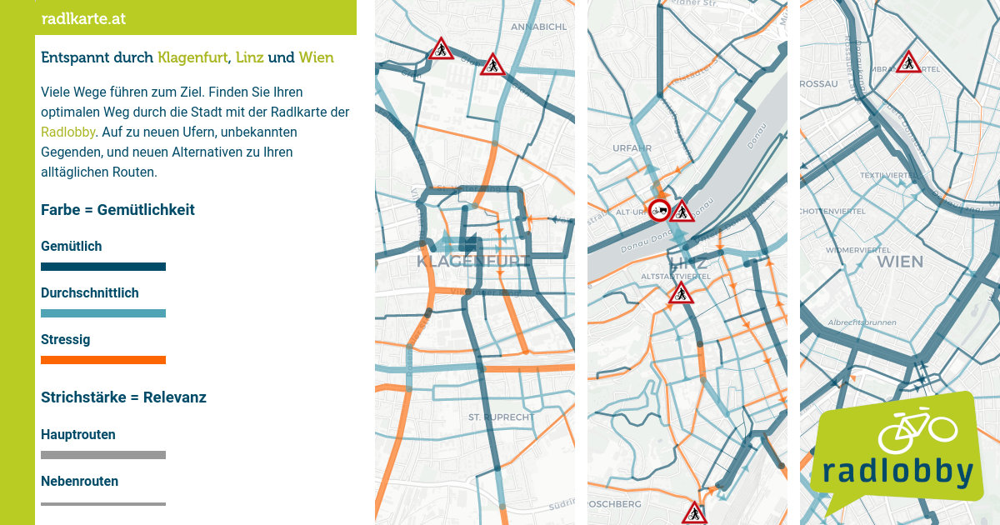

# radlkarte.at

Website for desktop, tablet & smartphone usage with the goal to provide useful (route) information for cyclists.

> If you use the software and/or route data the preferred way to credit is: **© radlkarte.at - Radlobby Österreich**

## Features

- Show recommended bicycle routes
  - Three quality types of route segments: calm, medium, stressful
  - Three importance levels of route segments: main, regional, local
    - Hide parts of the recommended routes when zooming out (for a better overview)
  - Special properties of the routes
    - Oneway (arrow)
    - Steep (bristles)
    - Unpaved (dotted lines)
- Automatically switch to the bicycle routes of the currently viewed region
- Show problematic points along the route where dismounting or usage of heavy/wide bicycles may not be possible
- Show POIs relevant for cycling (bike-sharing stations, bicycle shops,..)
- GPS localization (especially useful for mobile devices)
- Geocoding (address search)

## Route Data

Route data is stored in `GeoJSON` format with the following attributes.

### Line Attributes

**Mandatory**:
- `priority`=`0` (highest), `1` (medium), `2` (lowest)
- `stress`=`0` (no stress), `1` (medium), `2` (a lot of stress)

**Optional** (omitting the attributes means `no`):
- `oneway`=`yes`: route only legal in one direction
- `steep`=`yes`: very steep, e.g. more than  5-6%, but excluding short ramps
- `unpaved`=`yes`: dirt, gravel or extremely uneven surfaces even though they are paved
- `fixme`=`yes`: segment needs to be (re)evaluated. No special rendering on the radlkarte website though!

See the detailed explanations in `index.html` for when to choose which priority / stress category.

In addition an `id` is automatically generated by the `prepare_geojson.py` script.

### Point Attributes

- `dismount`=`yes`: bicycle must or should be pushed (in at least one direction), either due to legal restrictions or because it's a very dangerous spot
- `nocargo`=`yes`: not feasible for heavy/extra-long/extra-wide bicycles, e.g. cargo bicycles or bikes with trailers due to e.g. stairs or chicanes
- `warning`=`yes`: problematic location, should always be combined with the `description` attribute
- `speed100`=`yes`: road with a 100 kph speed limit and no separate cycling infrastructure (to highlight especially dangerous segments)
- `swimming`=`yes`: Badestelle (bathing spot / swimming location)
- `priority`=`0` | `1` | `2`: how prominently the point is drawn — `0` shows it from low zoom levels at full size, `2` only when zoomed in close. If absent, the point is treated as priority `1`; unreviewed points are highlighted in JOSM by the MapCSS style
- `description`: (optional) string explaining details shown to users in a popup

### Edit Instructions

1. [Install JOSM](https://josm.openstreetmap.de)
2. Add [josm-radlkarte-style.mapcss](data/josm-radlkarte-style.mapcss) in `Edit > Preferences… > Map Paint Styles` (~9th buttom from the top) (In older JOSM versions `Map Paint Styles` is under `Map Settings` (3rd button from the top).)
3. Load an existing radlkarte `GeoJSON` file, e.g. [radlkarte-example.geojson](data/radlkarte-example.geojson), or create a new layer
4. Edit routes
5. Save the result as `GeoJSON` (not as `.osm`!)
6. Prepare (minify, add bbox,..) the .geojson with [prepare_geojson.py](data/prepare_geojson.py)
   - with [development tools](./Development.md): `yarn geojson [path to GeoJSON file]`
   - without development tools: `./data/prepare_geojson.py [path to GeoJSON file]`

Due to limitations in the JOSM painting styles extra line attributes are shown differently than on the website:

| Line attribute | Visualization |
| --- | --- |
| `fixme=yes` | yellow casing |
| `steep=yes` | magenta casing |
| `unpaved=yes` | green casing |

The JOSM style also highlights problems while you edit:

| Highlight | Meaning |
| --- | --- |
| Red ring / red casing | An attribute has a value radlkarte does not accept, e.g. `dismount=1` or `oneway=true` instead of `yes`, or `priority=x`. Or a line is missing one of the mandatory `priority` / `stress` pair. |
| Yellow ring | A problem point without an explicit `priority`. Not an error — it renders with medium prominence — but it has not been reviewed yet. |

`prepare_geojson.py` reports the same value errors on the command line and exits with
a non-zero status when it finds any, so they are visible with or without JOSM. It
checks points only; the way highlights above have no command-line equivalent yet.

## Development (tools)

Further information for developing the radlkarte.at codebase and using the development tools can be found in the [development documentation](Development.md).

## License

The license for all our code and data is [here](LICENSE).

Obviously this excludes the libraries [leaflet (BSD 2-Clause)](https://leafletjs.com), font-awesome, [opening_hours.js (LGPLv3)](https://github.com/opening-hours/opening_hours.js) or jquery and the fonts.

Other exceptions:
- railway icon based on https://de.m.wikipedia.org/wiki/Datei:Train_Austria.svg
- bicycle shop icon based on cart by Alfa Design from <a href="https://thenounproject.com/browse/icons/term/cart/" target="_blank" title="cart Icons">Noun Project</a> (CC BY 3.0)
- bicycle repair station icon based on icon taken from the [OpenStreetMap-carto](https://github.com/gravitystorm/openstreetmap-carto) style licensed under CC0 public domain
- bicycle tube vending icon based on icon taken from https://github.com/cyclosm/cyclosm-cartocss-style licensed under BSD-3-Clause license
- bicycle pump icon based on icon from https://github.com/osmandapp/OsmAnd-resources
- drinking water icon based on Drinking Water by Dmitry Baranovskiy from <a href="https://thenounproject.com/browse/icons/term/drinking-water/" target="_blank" title="Drinking Water Icons">Noun Project</a> (CC BY 3.0)
